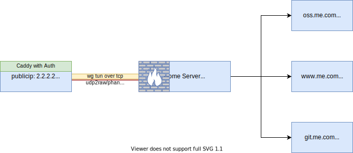

# 使用 Caddy 在公网发布 Home Server 上的个人网站

## Update
- 2024-0330: TODO 本方案过于复杂，应该使用其他反向端口映射工具实现

## Target

即要把服务器和个人数据保存在内网个人服务器，又要可以允许个人博客等站点可以通过公网访问，所以需要通过公网访问家中服务器上部署的 web 服务，同时配置安全规则，阻止未知的访问。

## 规划

如图，在家中的服务器和公网服务器之间，创建隧道，配置安全规则，在公网使用 `caddy` 监听 https 访问，通过隧道转发到内网服务对应的端口，并且对需要保护的站点配置认证登录。



## 需要的资源
- 一个可以控制的域名: `me.com`
- 一台有公网 ip 的主机，假设 ip 为 `2.2.2.2`

## 配置

### 隧道

由于可能需要在不同的端口上发布多个不同的站点，所以使用隧道的方式在家中的服务器和公网服务器之间建立连接, 可以使用任何方式创建隧道，本文不讨论相关内容，假设隧道两端的 ip 分别如下:

- 公网端: `192.168.2.1`
- 内网服务器端: `192.168.2.2`

### 公网端

#### 公网服务器端安全规则配置

除创建隧道必要的端口和 `ssh` 端口外，只打开 `80` 和 `443` 端口的访问。

#### dns 配置

分别配置 `www.me.com` `git.me.com` `oss.me.com` 的 dns 记录，指向公网服务器的公网 ip `2.2.2.2`

#### caddy http 服务器配置

```yaml
{
        http_port 80
        https_port 443
}
(tun) {
        {args.0}.me.com {
                import /etc/caddy/caddy_security.conf
                encode zstd gzip
                reverse_proxy 192.168.16.2:{args.1}

                handle_errors {
                        respond "Local: {http.error.status_code} {http.error.status_text}"
                }
        }
}

import tun git 8000
import tun www 8001
import tun oss 8002
```

### 内网端

假设内网服务器上有三个服务: `www`, `git` 和 `oss`, 分别监听在 `8000`, `8001` 和 `8002` 端口。
我们需要配置安全规则，只允许从公网端通过隧道连接 `8000`, `8001`, `8002` 这三个端口，阻止其他所有的链接。

```bash
iptables -N wg-input
iptables -N wg-input-http
iptables -A INPUT -i wg0 -j wg-input
iptables -A wg-input -m state --state ESTABLISHED,RELATED -j ACCEPT
iptables -A wg-input -p tcp --dport 8000 -j wg-input-http
iptables -A wg-input -p tcp --dport 8001 -j wg-input-http
iptables -A wg-input -p tcp --dport 8002 -j wg-input-http
iptables -A wg-input -j REJECT
iptables -A wginput-http  -s 192.168.2.1 -j ACCEPT
```
## ref

[ngrok for the wicked, or expose your ports comfortably](https://solovyov.net/blog/2022/ngrok-for-the-wicked/)

